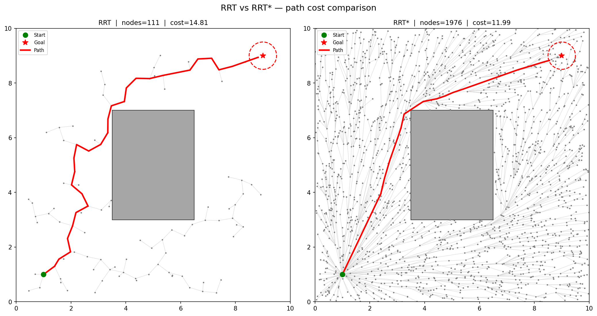
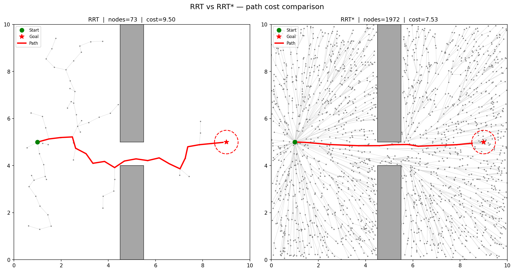
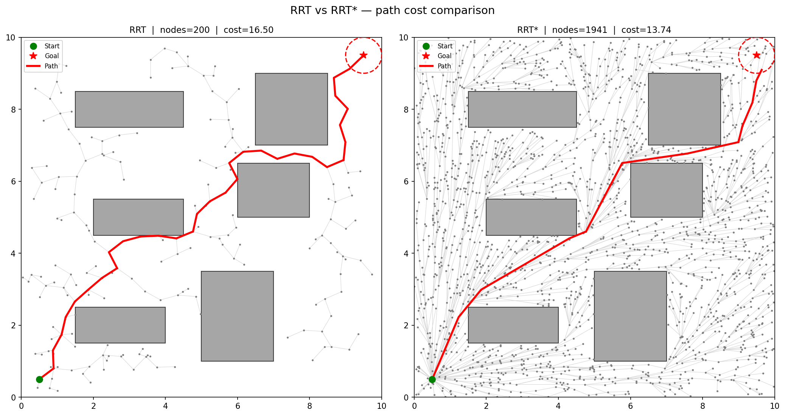
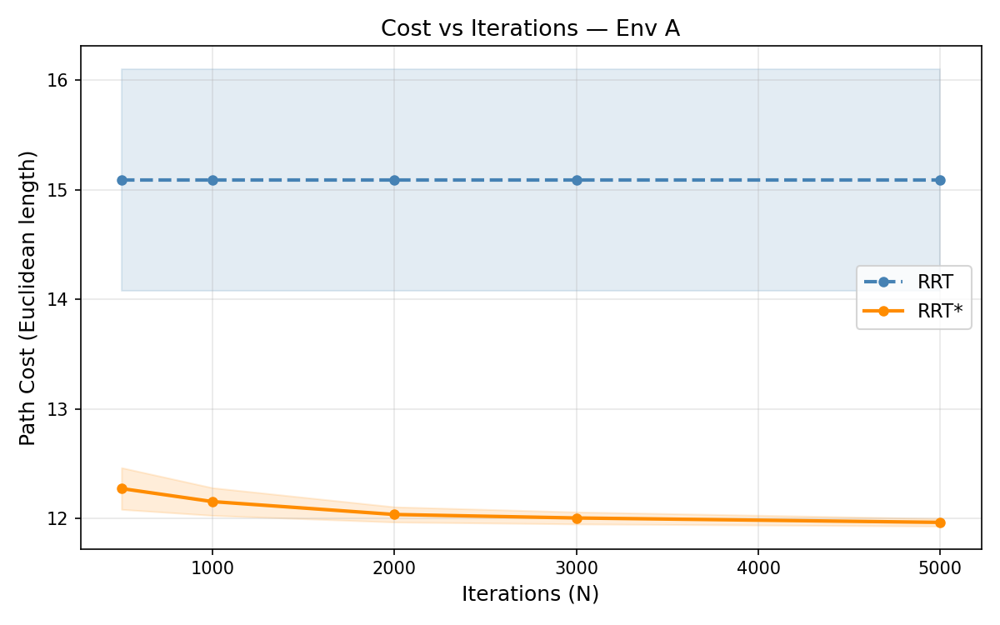
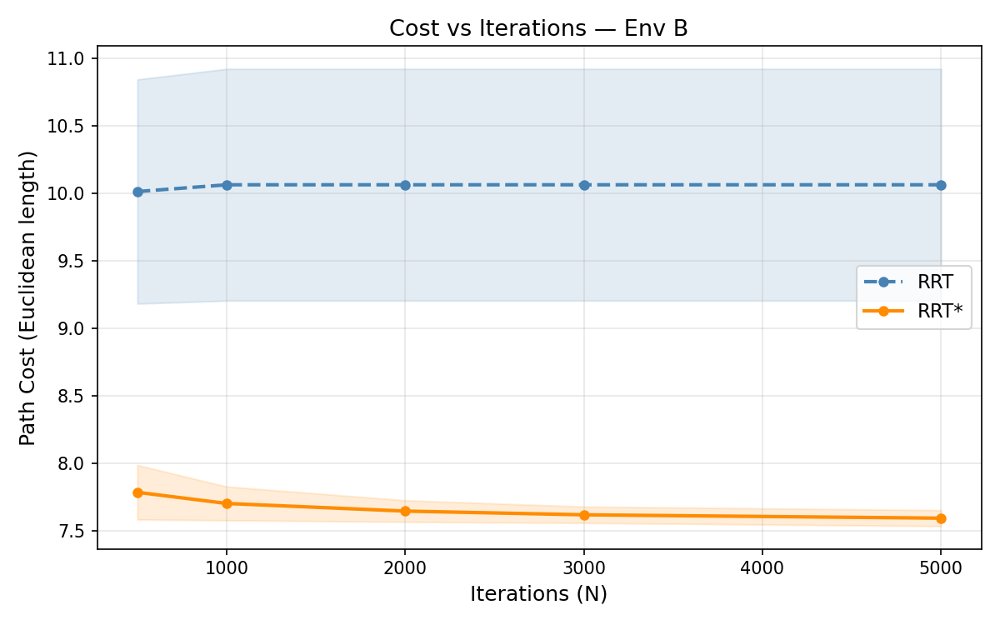
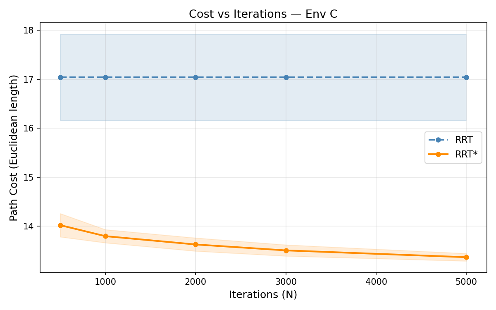

# RRT* — Sampling-Based Optimal Motion Planning

CS5100 Foundations of Artificial Intelligence · Northeastern University · Spring 2026  
Shreesh Kulkarni

Reproduction of core experimental results from:
> Karaman, S. & Frazzoli, E. (2011). *Sampling-based algorithms for optimal motion planning.*  
> International Journal of Robotics Research, 30(7), 846–894.  
> [Full paper (PDF)](../1105.1186v1.pdf)

---

## What is RRT*?

**RRT (Rapidly-exploring Random Tree)** is a sampling-based motion planning algorithm that builds a tree by randomly sampling the free space and connecting new nodes to the nearest existing node. It is fast and complete — but it stops at the *first* path it finds, which is typically far from optimal.

**RRT\*** extends RRT with two key operations that make it *asymptotically optimal*:

| Operation | What it does |
|-----------|-------------|
| **ChooseParent** | When adding a new node, search all nearby nodes and pick the one that minimizes total path cost — not just the nearest. |
| **Rewire** | After adding a node, check if any nearby nodes would have a cheaper path *through* the new node, and re-parent them if so. |

### Advantages of RRT* over RRT

- **Asymptotic optimality** — given enough iterations, RRT* converges to the globally optimal path. RRT has no such guarantee.
- **Monotonically improving paths** — path cost decreases with each iteration; RRT's cost is fixed after the first solution.
- **Better in constrained environments** — the rewiring step is especially effective in narrow passages where the first path found is highly suboptimal.
- **Same asymptotic runtime** — the rewiring radius shrinks as the tree grows (Theorem 38, Karaman & Frazzoli 2011), so per-iteration cost stays O(log n).

---

## Project Structure

```
rrt_star/
├── environment.py      # Map, obstacles, collision detection (slab method for AABB)
├── utils.py            # Node, KDTree index, rewire_radius, steer, extract_path
├── rrt.py              # Baseline RRT (stops at first solution)
├── rrt_star.py         # RRT* (ChooseParent + Rewire, runs all iterations)
├── visualise.py        # Matplotlib: tree/path plots, cost curves, side-by-side
├── experiments.py      # Systematic study: 3 envs × 2 algos × N_vals × trials
├── main.py             # CLI entry point
├── results/            # CSVs written by experiments.py
├── figures/            # PNGs written by visualise.py
└── requirements.txt
```

---

## Setup

### 1. Create and activate a virtual environment

```bash
python3 -m venv .venv
source .venv/bin/activate      # macOS / Linux
# .venv\Scripts\activate       # Windows
```

### 2. Install dependencies

```bash
pip install -r requirements.txt
```

Dependencies: `numpy`, `scipy`, `matplotlib`, `pandas`

> **Important:** Always use the venv python to run scripts. The system `python3` will not have the required packages installed.

---

## Running the Project

### Demo — one-shot visualisation

Runs RRT and RRT* once and saves a side-by-side comparison to `figures/`.

```bash
python main.py --mode demo --env a   # Environment A: single central obstacle
python main.py --mode demo --env b   # Environment B: narrow passage
python main.py --mode demo --env c   # Environment C: maze-like
```

Optional flags:

```bash
python main.py --mode demo --env a --n_iter 5000 --seed 123
```

### Full experiment suite

Runs the complete study and saves CSVs + cost-vs-iterations plots.

```bash
python main.py --mode experiment
```

- 3 environments × 2 algorithms × 5 iteration counts [500, 1000, 2000, 3000, 5000] × 50 trials
- Saves 7 CSVs to `results/` and 3 cost-curve PNGs to `figures/`
- Runtime: ~10–15 minutes on a modern laptop

#### Quick test (smoke test)

In `experiments.py`, flip `QUICK_TEST` before running:

```python
QUICK_TEST = True    # 5 trials, N in [500, 1000] — fast smoke test (~30 s)
QUICK_TEST = False   # 50 trials, full N range — paper-reproduction run
```

---

## Environments

| Env | Description | Difficulty |
|-----|-------------|------------|
| **A** | Single large central obstacle | Easy |
| **B** | Two tall walls with a ~1-unit gap (narrow passage) | Hard |
| **C** | Six smaller obstacles arranged maze-like | Medium |

All environments use a 10×10 map with start at (1, 1) and goal at (9, 9).

### RRT vs RRT* — Side-by-Side Trees

**Environment A** (single central obstacle)



**Environment B** (narrow passage)



**Environment C** (maze-like)



---

## Expected Results

- **RRT**: path cost plateaus immediately after the first solution is found — more iterations do not help.
- **RRT\***: path cost decreases monotonically as N grows, converging toward the optimum.
- **Env B (narrow passage)**: the cost gap between RRT and RRT* is widest — RRT's greedy first-path is especially poor here.
- **Runtime**: RRT* is slightly slower per iteration due to neighbor search and rewiring, but the overhead is O(log n) and not dramatic in practice.

### Cost vs Iterations

**Environment A**



**Environment B**



**Environment C**



---

## File Reference

| File | Key exports |
|------|-------------|
| `environment.py` | `Environment`, `make_env_a/b/c()` |
| `utils.py` | `Node`, `NearestNeighborIndex`, `rewire_radius()`, `steer()`, `extract_path()` |
| `rrt.py` | `run_rrt()` |
| `rrt_star.py` | `run_rrt_star()`, `choose_parent()`, `rewire()`, `propagate_cost()` |
| `visualise.py` | `plot_side_by_side()`, `plot_cost_vs_iterations()` |
| `experiments.py` | `run_trial()`, `run_experiment()`, `save_results()` |
| `main.py` | CLI: `--mode [demo\|experiment]`, `--env [a\|b\|c]`, `--n_iter`, `--seed` |
